<picture>
  <source media="(prefers-color-scheme: dark)" srcset="./dark.svg">
  <source media="(prefers-color-scheme: light)" srcset="./light.svg">
  
</picture>

<h1 align="center">Hi 👋, I'm Amna Noor Khan</h1>

<h3 align="center">
💻 Full-Stack Web Developer • AI & Machine Learning Enthusiast • BS Computer Science Student
</h3>

  

  

---

## 👩‍💻 About Me

- 🎓 BS Computer Science Student at FAST – National University
- 💻 Passionate about Full-Stack Web Development
- 🤖 Exploring Artificial Intelligence & Machine Learning
- 🌱 Currently learning React, Node.js, Python, Flask & SQL
- 🚀 Building modern, scalable web applications

---

## 💻 Tech Stack

---

---

## 🔥 GitHub Streak

---

---

## 📈 Contribution Graph

---

## 🚀 Featured Projects

- 🎮 Games E-commerce Store
- 🧠 Wumpus World AI Agent
- 🧩 Sudoku CSP Solver
- 💻 Operating System Simulator
- 📸 Mini Instagram (C++)
- 📇 Contact Book Management System
- 🎓 Student Management System

---

⭐ Thanks for visiting my profile!

